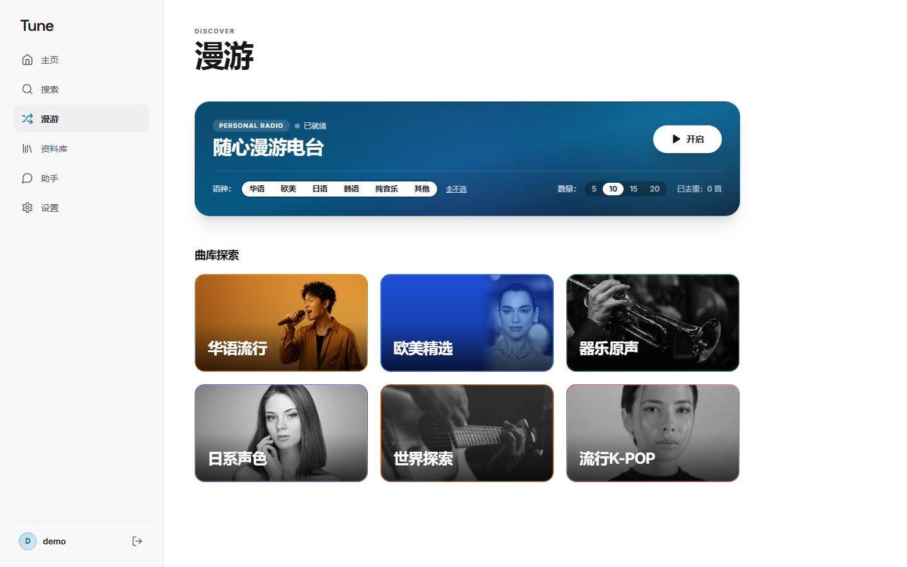
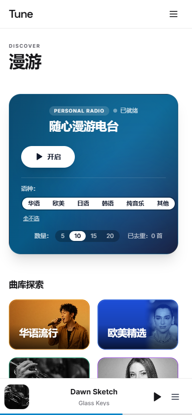
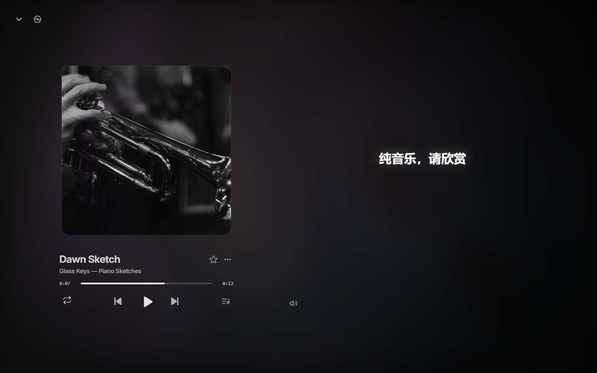

# FlareTune

**把自己的音乐，放进一个随时可听的私人空间。**

FlareTune 是一款面向个人、家庭和小型私有群体的自建音乐应用。你可以把自己的歌曲与封面放进曲库，在电脑和手机浏览、搜索和播放；每位成员用自己的账号保存收藏、歌单与收听记录。实例由你自己管理，音乐文件存放在你绑定的私有存储中。

## 页面预览

以下截图来自本地演示实例，使用虚构曲目和示例封面，展示 1440 px 桌面与 390 px 手机宽度下的实际页面。点击图片可查看原图；界面会随屏宽调整。

| 桌面：漫游与曲库探索 | 手机：同一页面的窄屏布局 |
| --- | --- |
|  |  |

| 桌面：全屏播放器 | 手机：全屏播放器 |
| --- | --- |
|  |  |

## 你可以用它做什么

### 找到想听的音乐

从主页进入曲库，按歌曲、歌手或专辑搜索；也可以通过「漫游」发现下一首。资料库集中呈现自己的收藏和歌单，最近听过的内容与收听足迹也能随时回看。

### 按自己的方式播放

播放器支持队列、播放控制和全屏欣赏。全屏可在经典封面与歌手写真两种视图间切换；歌词随音乐同步显示。遇到缺失或不准确的歌词，管理员可以在歌词工作台查找候选、编辑时间轴和译文，并保存到曲库供成员使用。

### 整理个人曲库

给喜欢的歌曲加星，建立和排序个人歌单；每个账号只管理自己的歌单和收听数据。管理员可在网页后台上传歌曲与封面、修正曲目信息、管理成员账号，并调整实例设置。

### 从本地目录入库

少量歌曲可以直接在网页后台选择文件。批量入库时，可以在存放音乐的电脑上运行 **Node.js 入库设备工具**：首次配置实例、管理员账号和音乐目录，之后用 `npm run ingest` 启动。工具主动连接 FlareTune；管理员可以在另一台设备的网页后台筛选目录歌曲、只勾选需要的部分，再与浏览器文件一起预览、编辑、查重和入库。运行工具的电脑无需开放公网端口。

安装、配置、多目录选择、语言映射和常见问题见[本地入库设备使用指南](tooling/ingest-agent/README.md)。

### 和音乐助手对话

助手「小A」可以围绕当前歌曲、曲库和个人收听内容回答问题，帮你找歌、控制播放或整理自己的歌单。AI 服务由实例管理员按需配置；不配置时，曲库和播放功能仍可使用。

### 调成喜欢的样子

支持跟随系统、浅色和深色外观，以及背景与播放器显示偏好。桌面与手机使用同一套曲库和账号数据。

## 适合谁

FlareTune 适合已经拥有音乐文件、希望自己管理曲库和访问权限的人。它不提供音乐订阅或内置版权曲库；请只导入你有权存储和使用的内容。

## 开始使用

FlareTune 从旧项目 5.0 演进为独立产品，首个发行版本从 **1.0.0** 开始。主要功能已在维护者的生产实例测试正常。Cloudflare 部署模板会为使用者绑定独立的 D1 和 R2；首次访问先验证初始化密钥，再建立数据库和管理员账户。空库安装与升级流程已通过本地 Worker 和 D1 演练，全新云端账号验收仍待完成，进度见[部署指南](guide/deployment.md)。

部署向导中填写高熵初始化密钥 `SETUP_SECRET`，D1 和 R2 由 Cloudflare 创建并绑定。仓库公开后按钮才可供其他用户使用；全新云端账号的安装流程仍待最终验收。

| 你想了解 | 入口 |
| --- | --- |
| 页面和功能如何使用 | [使用指南](guide/using-flaretune.md) |
| 如何部署、初始化与升级 | [部署指南与当前进度](guide/deployment.md) |
| 管理员可以配置什么 | [管理与维护](guide/administration.md) |
| 如何从本地目录批量入库 | [本地入库设备使用指南](tooling/ingest-agent/README.md) |
| 全部公开文档 | [文档索引](guide/README.md) |
| 版本变化 | [更新日志](CHANGELOG.md) |

## 后续开发方向

- **第三方播放器兼容**：计划研究实现 [Subsonic／OpenSubsonic API](https://opensubsonic.netlify.app/docs/)，让[音流](https://github.com/liuyincs/musiver)等支持该 API 的客户端连接 FlareTune。当前尚未提供兼容接口；先确定认证、曲库浏览、音频与封面读取等基础范围，再做客户端互通测试。
- **界面多语言**：计划为网页界面与公开文档加入多语言支持。当前的歌曲语言识别和目录语言映射只用于整理曲目，不代表界面已经完成国际化。

## 一起完善 FlareTune

入库设备工具已有可用版本，仍欢迎更多人验证不同系统、文件格式和较大曲库；协议兼容与多语言也需要共同设计和实现。欢迎熟悉 Node.js、Cloudflare Workers／R2、播放器 API 或翻译的朋友参与。可以从问题反馈、复现步骤、文档改进或代码贡献开始，详见[参与贡献](CONTRIBUTING.md)。请勿在公开反馈中附上音乐文件、密码或 Cloudflare 凭据。

## 许可与素材

项目原创代码与文档采用 [MIT 许可证](LICENSE)。页面照片来自 Unsplash，遵循 [Unsplash License](https://unsplash.com/license)，不纳入 MIT；品牌标识和参考数据的范围见[素材说明](ASSETS.md)。
