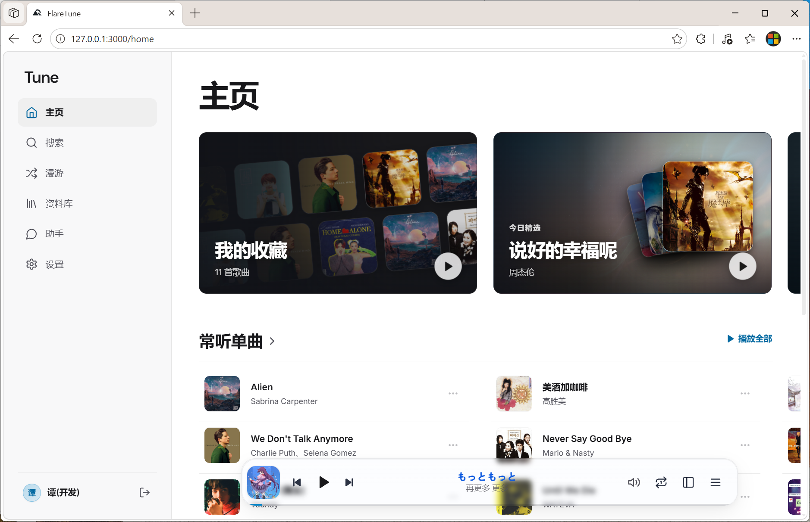
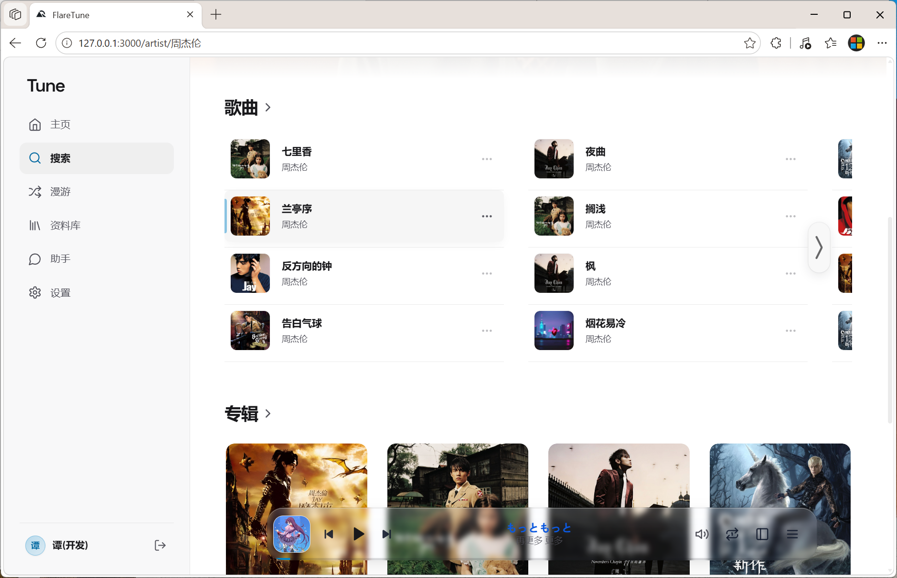
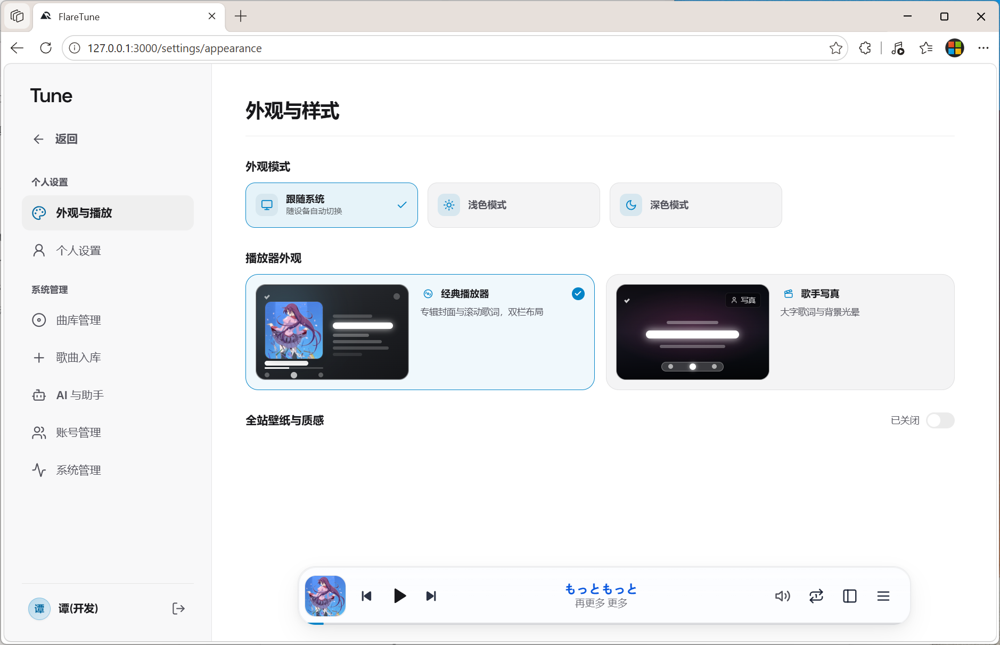
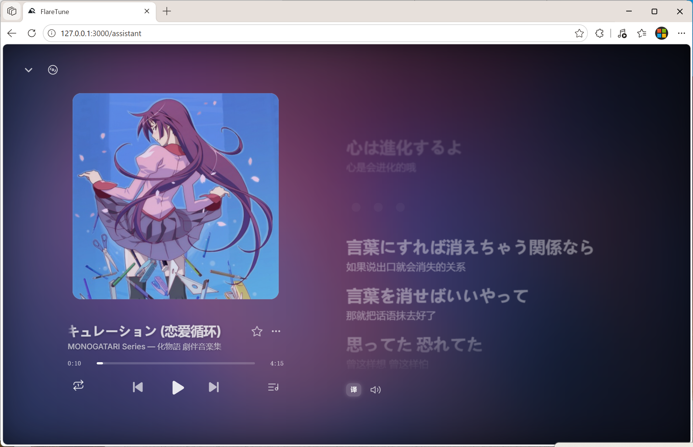
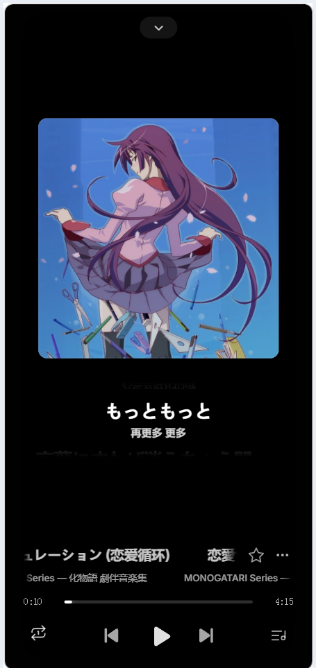

#  FlareTune

[简体中文](README.md) · [English](README.en.md)

**把自己的音乐，放进随时可听的私人曲库。**

FlareTune 是一款面向个人和家庭的自建音频流媒体应用。管理员导入自己的音频文件后，成员可以在电脑或手机上找歌、播放、收藏和整理歌单。曲库数据与媒体文件分别保存在部署者自己的 Cloudflare D1 和私有 R2 中。

[界面预览](#界面预览) · [功能](#功能) · [部署](#部署到-cloudflare) · [使用指南](guide/using-flaretune.md) · [参与贡献](CONTRIBUTING.md)

## 界面预览

桌面端主页展示曲库内容、常听歌曲和播放入口。下方截图还展示歌手页、播放器、手机歌词页与外观设置。点击图片可查看原图。

| 歌手与专辑 | 外观与播放设置 |
| --- | --- |
|  |  |

| 桌面端全屏播放器 | 手机端封面视图 | 手机端歌词视图 |
| --- | --- | --- |
|  |  |  |

## 功能

- **浏览与播放**：按歌曲、歌手和专辑搜索，或通过「漫游」探索曲库；播放器支持队列、全屏封面和同步歌词。
- **个人资料库**：每个账号管理自己的收藏、歌单和收听内容，桌面与手机共用同一套数据。
- **曲库管理**：管理员可在网页中上传歌曲和封面、编辑曲目信息、管理成员账号；大量本地文件可使用[入库设备工具](tooling/ingest-agent/README.md)挑选并导入。
- **可选音乐助手**：管理员配置 AI 模型后，助手「小A」可回答曲库相关问题、找歌和协助整理歌单；不配置也能正常使用曲库与播放器。
- **外观选择**：支持跟随系统、浅色和深色主题，以及背景和播放器样式偏好。

## 部署到 Cloudflare

使用 Cloudflare 账号点击下方按钮，部署向导会创建并绑定 Worker、D1 数据库和私有 R2 存储桶。

1. 在部署向导中填写至少 32 个字符的随机 `SETUP_SECRET`，并保存好该密钥。
2. 部署完成后打开实例地址，输入 `SETUP_SECRET` 验证首次初始化。
3. 创建首个管理员账号，然后登录并导入音乐。

详细的初始化、升级和数据备份步骤见[部署与初始化指南](guide/deployment.md)。

## 开发与文档

项目使用 React、Vite 和 Cloudflare Workers，数据使用 D1，音频与封面使用私有 R2。本地开发需要 Node.js 22.18+（22.x）或 24.11+；完整的启动与验证步骤见[本地开发指南](guide/local-development.md)。

| 文档 | 内容 |
| --- | --- |
| [使用指南](guide/using-flaretune.md) | 找歌、播放、歌单、助手和个人设置 |
| [第三方客户端](guide/subsonic.md) | Subsonic 开关、连接方法、兼容范围与用户验收 |
| [Google 登录](guide/google-login.md) | 管理员配置、已有账号绑定、免输本站密码登录 |
| [部署与初始化](guide/deployment.md) | 首次安装、密钥、升级和数据备份 |
| [管理与维护](guide/administration.md) | 曲库、账号、实例设置和数据维护 |
| [本地入库设备](tooling/ingest-agent/README.md) | 批量读取本地目录并在网页中挑选歌曲 |
| [全部文档](guide/README.md) | 面向使用者和管理员的文档索引 |
| [更新日志](CHANGELOG.md) | 版本变化与已知限制 |

## 关于项目

FlareTune 源自我的个人音乐播放器「乐境」。从乐境 4.0 到 5.0，项目经历了一年多的持续迭代；随后以 FlareTune 1.0.0 作为独立开源项目的起点。

我希望有更多愿意投入的开发者参与，一起把它做得更好。欢迎从代码、设计、测试或文档开始贡献，具体方式见[参与贡献](CONTRIBUTING.md)。如果使用中遇到问题，请通过 [GitHub Issues](https://github.com/arctan303/FlareTune/issues) 反馈，尽量附上运行环境、复现步骤和必要的脱敏日志。我会认真跟进并持续修复。感谢你的支持。

## 许可

代码与文档采用 [MIT 许可证](LICENSE)；协议 MD5 实现沿用旧 FlareTune 的 [Apache-2.0 许可证](licenses/legacy-flaretune-Apache-2.0.txt)。图片与品牌素材见[素材说明](ASSETS.md)。
